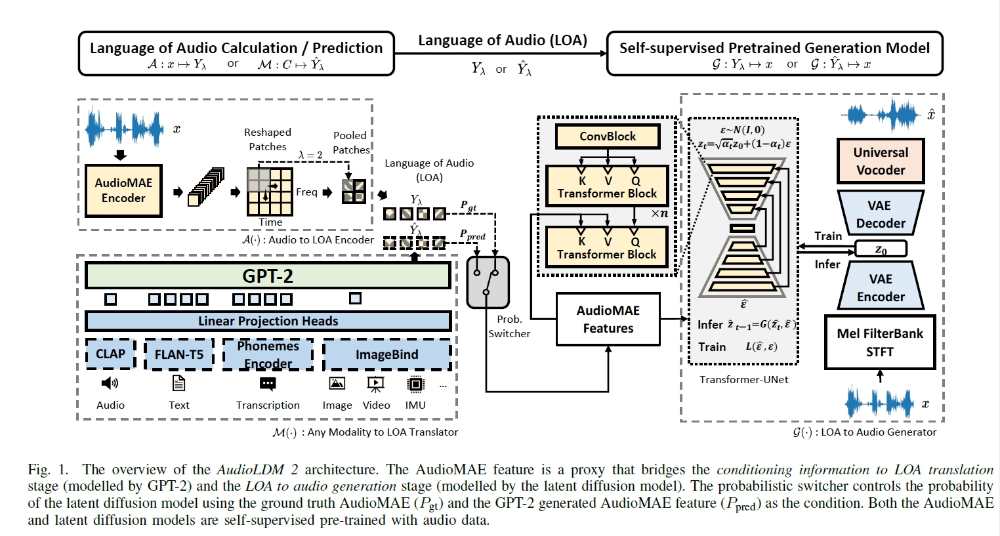

### 姓名

NKNaN

### 开发中的快乐开源任务

AudioLDM2模型复现前向推理

### 本双周工作

1. **热身打卡任务**

   - 修改飞桨文档：学习了飞桨 API 文档书写规范以及中英文文档对应法则，提交了文档修复的 pr ：[58919](https://github.com/PaddlePaddle/Paddle/pull/58919)、[6307](https://github.com/PaddlePaddle/docs/pull/6307)。

   - 完成 Paddle 本地编译：学习了 docker 在 windows 平台的安装与使用（通过wsl2），但由于虚拟内存的问题或 windows 家庭版的某些原因导致始终没有在本地编译成功。之后申请了 AI Studio 框架开发功能并利用 AI Studio 框架开发功能完成 Paddle 编译任务。

   - Stable-Diffusion 训练推理：由于本地内存不够，利用 AI Studio v100 完成了 Stable-Diffusion 的训练推理任务。

2. **大模型快乐开源任务**

   - 详细阅读 [AudioLDM2](https://arxiv.org/pdf/2308.05734.pdf) 论文并略读了论文中所提到的相关模型对应的论文，包括：
     1. [AudioLDM](https://arxiv.org/pdf/2301.12503.pdf)
     2. [Masked Autoencoders that Listen](https://arxiv.org/pdf/2207.06405.pdf) - AudioMAE
     3. [Denoising Diffusion Probabilistic Models](https://proceedings.neurips.cc/paper/2020/file/4c5bcfec8584af0d967f1ab10179ca4b-Paper.pdf) - DDPM
     4. [High-Resolution Image Synthesis with Latent Diffusion Models](https://openaccess.thecvf.com/content/CVPR2022/html/Rombach_High-Resolution_Image_Synthesis_With_Latent_Diffusion_Models_CVPR_2022_paper.html) - LDM

   - 阅读 [AudioLDM2 代码](https://github.com/haoheliu/AudioLDM2)，部分梳理了现有代码的执行逻辑，并尝试将已经梳理的代码转化为 Paddle 框架，已梳理部分主要包括：
     1. `.\bin\audioldm2`
     2. `.\pipline.py`
     3. `.\latent_diffusion\models\ddpm.py`
     4. `.\latent_diffusion\modules\encoders\modules.py`

个人理解的 AudioLDM2 结构如下：

该结构可以分解为两大部分，图片左侧为 LOA (Language of Audio) 编码部分，右侧为隐式扩散生成模型部分。
- 图片中 $ \mathcal{A}(\cdot) $ 部分主体是 AudioMAE。AudioMAE 是一个自监督的编码器，将音频编码为 LOA，直接用预训练好的参数即可。这一部分的作用主要是用于训练 LDM 的，所以在推理过程中应该不涉及。
- $ \mathcal{M}(\cdot) $ 部分主体是 GPT2 ，用来将音频、文本、图片、视频等翻译为 LOA。其中的 CLAP 、FLAN-T5 以及 Imagebind 的模型参数直接固定使用预训练的，而 phoneme encoder 的参数是在训练 LDM 的同时一起训练的。CLAP 模型可以编码文本和音频输入，获取的是全局条件；FLAN-T5 编码文本输入，获取局部细节条件；phoneme encoder 处理 TTS 任务的文本输入；ImageBind 用来处理图像输入。
- $ \mathcal{G}(\cdot) $ 部分主体是 LDM ，用来通过得到的 LOA 条件生成音频。LDM 中的 Transformer-UNet 结构如图所示。

3. **问题疑惑与解答**

   - 问题：复现的代码是否需要有固定的存储格式，如 `paddlemix\models\audioldm2` 下需要有一个 `modeling.py` 存放总的模型，还需要一个 `configuration.py` 存放模型参数；`paddlemix\examples\audioldm2` 下需要有 md 文档和 `run_predict.py` ？总的模型需要继承自 `MixPretrainedModel`， configuration 类需要继承自 `PretrainedConfig` ?

     答：xxx

   - 问题: 不确定上面描述的对模型的理解有没有什么问题，如果有的话请指出。从目前的梳理和已经公开的代码以及 hugging face 上的 demo 来看，已经公开的代码能够完成的任务包括 text-to-audio 和 text-to-speech ，似乎还没有公开其他形式任务的推理代码，我们是否只需要将已有的这两个任务实现就好？

     答：xxx

   - 问题: 子模型中需要加载预训练参数的时候应该怎么加载呢，预训练好的模型是 pytorch 的，是需要先把参数取出来然后转成 `paddle.Tensor` 再调用 `model.load_dict` 还是该如何操作？

     答：xxx

### 未来双周计划

1. 继续梳理并转换推理代码的框架
