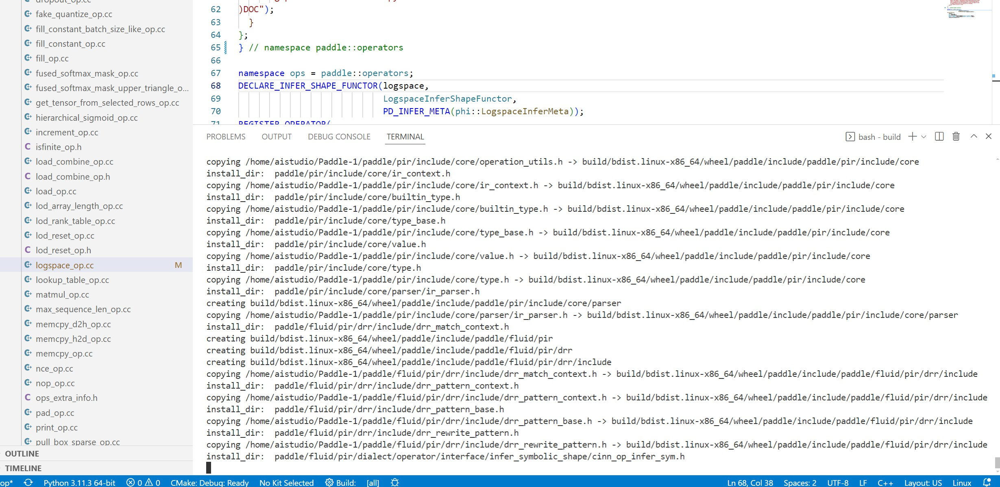

### 姓名

谢煜

### 开发中的快乐开源任务

专项团：PaddleMix快乐开源活动

### 本双周工作

1. 热身打卡任务 Paddle 本地编译

3. **问题疑惑与解答**

   这里卡住了,进程无法停下，按CTRL C没反应（前面的操作是改了/home/aistudio/Paddle/paddle/fluid/operators/logspace_op.cc的如图的注释，然后二次编译跑了卡了）

### 未来双周计划

1. typos工具引入计划
2. 合入1个非热身任务PR
