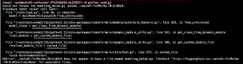
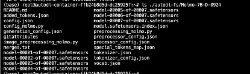
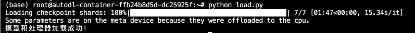
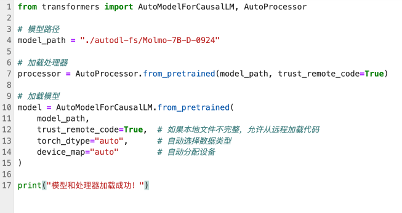
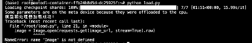
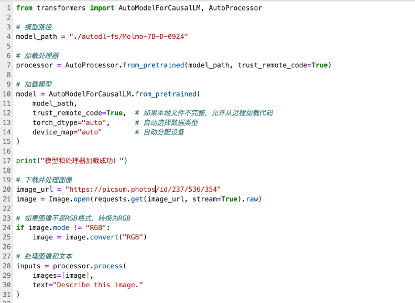
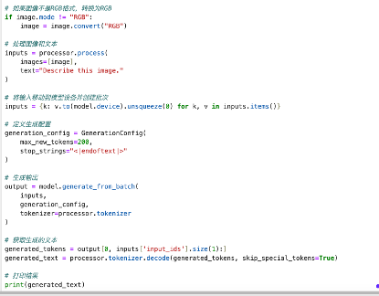
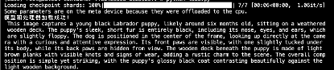
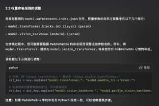

### 姓名

冀凤献（baixiaochunhx）

### 开发中的快乐开源任务

Molmo 模型推理	模型复现	Molmo-7B-D-0924推理对齐

### 本双周工作	

1. **Molmo-7B-D-0924推理对齐**

推理对齐
1.Molmo 7B-D 部署
   •	服务器硬件：
   •	GPU：推荐至少一块 NVIDIA GPU（如 A100、V100、RTX 3090）以支持加速推理。
   •	内存：至少 32GB RAM。
   •	存储：足够的存储空间（至少 50GB）用于模型文件和依赖。

1.模型和处理器加载

进行模型和处理器加载时候总是缺少文件，这里我使用ls ./autodl-fs/Molmo-7B-D-0924命令将文件列出来方便自己来进行查看，最后调试好了

Load.py代码

2.PyTorch转Paddle教程

1. 模型概述
Molmo-7B-D-092 模型由以下两个核心部分组成：
   •	视觉编码器：用于处理和编码图像输入，通常基于如 ResNet、ViT 等架构。
   •	语言模型：用于处理和生成文本，可能基于 Transformer 架构，如 GPT、BERT 等。
2. 权重转换

将 PyTorch 权重转换为 PaddlePaddle 权重的关键步骤如下：

2.1 分析模型结构
   1.	查看模型结构代码：了解 Molmo-7B-D-092 在 PyTorch 中的定义，识别各个层及其参数命名。
   2.	检查 model.safetensors.index.json 文件（如果存在）：确定权重文件的映射关系和分片情况。 
通过 weight_map，我们可以知道每个参数存储在哪个文件中。

2.2 处理 PyTorch 和 Paddle 的差异

在权重转换过程中，需要注意以下几点差异：
   •	线性层权重转置：PaddlePaddle 中的线性层权重需要与 PyTorch 相反的维度顺序，通常需要进行转置。
   •	权重命名调整：PyTorch 和 PaddlePaddle 的命名规范可能不同，需要调整权重的命名以适配 PaddlePaddle。
这个目前还没完成，抽空整理一下

3. 代码转换注意事项
1. 使用 PaConvert 工具进行初步转换
3. 手动调整张量操作
3.1 view → reshape
3.2 permute → transpose
3. 替换激活函数和层
4. 手动添加位置编码（如 Qwen2 模型）
5. 调整 Flash Attention 函数调用参数
4. 代码组织优化
建议按照paddlemix规范组织代码结构：
按照 PaddleMIX 规范组织代码结构，有助于提高代码的可维护性和可读性。推荐的代码结构如下：
paddlemix/
├── models/          # 模型代码
├── examples/        # 预测脚本
└── processors/      # 图像预处理

3. Paddle环境运行

目前代码和模型已经准备好，但前面的转换还在跑，周一的时候补齐剩下的pr

### 未来双周计划
继续在大模型推理的任务进行完成，多去尝试几个大模型推理
### 姓名

冀凤献（baixiaochunhx）

### 开发中的快乐开源任务

Molmo 模型推理	模型复现	Molmo-7B-D-0924推理对齐

### 本双周工作	

1. **Molmo-7B-D-0924推理对齐**

推理对齐
1.Molmo 7B-D 部署
   •	服务器硬件：
   •	GPU：推荐至少一块 NVIDIA GPU（如 A100、V100、RTX 3090）以支持加速推理。
   •	内存：至少 32GB RAM。
   •	存储：足够的存储空间（至少 50GB）用于模型文件和依赖。

1.模型和处理器加载

进行模型和处理器加载时候总是缺少文件，这里我使用ls ./autodl-fs/Molmo-7B-D-0924命令将文件列出来方便自己来进行查看，最后调试好了

Load.py代码

2.PyTorch转Paddle教程

1. 模型概述
Molmo-7B-D-092 模型由以下两个核心部分组成：
   •	视觉编码器：用于处理和编码图像输入，通常基于如 ResNet、ViT 等架构。
   •	语言模型：用于处理和生成文本，可能基于 Transformer 架构，如 GPT、BERT 等。
2. 权重转换

将 PyTorch 权重转换为 PaddlePaddle 权重的关键步骤如下：

2.1 分析模型结构
   1.	查看模型结构代码：了解 Molmo-7B-D-092 在 PyTorch 中的定义，识别各个层及其参数命名。
   2.	检查 model.safetensors.index.json 文件（如果存在）：确定权重文件的映射关系和分片情况。 
通过 weight_map，我们可以知道每个参数存储在哪个文件中。

2.2 处理 PyTorch 和 Paddle 的差异

在权重转换过程中，需要注意以下几点差异：
   •	线性层权重转置：PaddlePaddle 中的线性层权重需要与 PyTorch 相反的维度顺序，通常需要进行转置。
   •	权重命名调整：PyTorch 和 PaddlePaddle 的命名规范可能不同，需要调整权重的命名以适配 PaddlePaddle。
这个目前还没完成，抽空整理一下

3. 代码转换注意事项
1. 使用 PaConvert 工具进行初步转换
3. 手动调整张量操作
3.1 view → reshape
3.2 permute → transpose
3. 替换激活函数和层
4. 手动添加位置编码（如 Qwen2 模型）
5. 调整 Flash Attention 函数调用参数
4. 代码组织优化
建议按照paddlemix规范组织代码结构：
按照 PaddleMIX 规范组织代码结构，有助于提高代码的可维护性和可读性。推荐的代码结构如下：
paddlemix/
├── models/          # 模型代码
├── examples/        # 预测脚本
└── processors/      # 图像预处理

3. Paddle环境运行

目前代码和模型已经准备好，但前面的转换还在跑，周一的时候补齐剩下的pr

### 未来双周计划
继续在大模型推理的任务进行完成，多去尝试几个大模型推理
